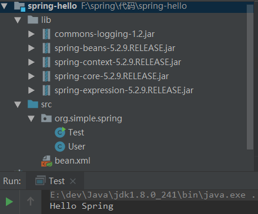
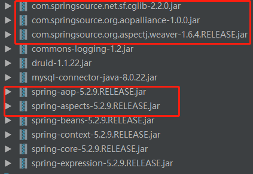
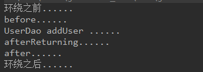
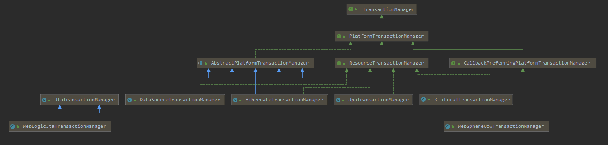

## Spring框架学习

### 一. Spring框架基本概述

1. Spring是一个轻量级的开源JavaEE框架。

2. Spring可以解决企业应用开发的复杂性。

3. Spring有两个核心部分：IOC和AOP

   IOC：控制反转，把创建对象的过程交给Spring进行管理。

   AOP:  面向切面，在不修改源代码的情况下进行功能的增强。

4. Spring的特点

   (1) 方便解耦，简化开发。

   (2) AOP编程支持。

   (3) 方便程序测试。

   (4) 方便与其他框架的整合。

   (5) 方便进行事物操作。

   (6) 降低API开发难度。

5. Spring的下载。

   (1) Spring的官网地址：[Spring官网地址](https://spring.io)。

   (2) Spring发行版本地址：[Spring发行版本地址](https://repo.spring.io/webapp/#/artifacts/browse/tree/General/release/org/springframework/spring)。

   (3) Spring下载文件含义说明：

   ​	spring-aop-5.2.9.RELEASE.jar:    		编译后的class文件                            

    	spring-aop-5.2.9.RELEASE-javadoc.jar：	文档

   ​	spring-aop-5.2.9.RELEASE-sources.jar	源代码文件

6. Spring组成模块。

   

   ​											Spring框架图


###二. Spring入门案例

1. 使用IDEA创建一个普通的Java工程。

2. 将Spring的核心jar包添加到工程的依赖中。

   commons-logging-1.2.jar

   spring-beans-5.2.9.RELEASE.jar

   spring-core-5.2.9.RELEASE.jar

   spring-context-5.2.9.RELEASE.jar

   spring-expression-5.2.9.RELEASE.jar

   Spring框架的运行需要依赖commons-logging-1.2.jar,其余的四个jar包则为Spring框架的核心。

3. 将添加的jar包导入到工程环境中。

   Project settings ---->  Modules ------> +(Add JARS or directories) -----> 需要添加的jar包

4. 编写一个用于测试Spring创建对象的类。

   ```java
   public class User {

       private String name;

       private Integer age;
   	
   	//一个普通方法
       public void sayHello(){
           System.out.println("Hello Spring");
       }
       //省略getter/setter  
     
     	@Override
       public String toString() {
           return "User{" +
                   "name='" + name + '\'' +
                   ", age=" + age +
                   '}';
       }
   }
   ```

5. 编写Spring的配置文件,在配置文件中创建一个User类的对象。

   ```xml
   <?xml version="1.0" encoding="UTF-8"?>
   <beans xmlns="http://www.springframework.org/schema/beans"
          xmlns:xsi="http://www.w3.org/2001/XMLSchema-instance"
          xsi:schemaLocation="http://www.springframework.org/schema/beans http://www.springframework.org/schema/beans/spring-beans.xsd">
      
       <bean id="simple" class="org.simple.spring.User">
           <property name="name" value="simple"/>
           <property name="age" value="25"/>
       </bean>
       
   </beans>
   ```

6. 编写测试代码，获取在Spring配置文件中配置的创建的对象。

   ```java
   public class Test {

       public static void main(String[] args) {
           //通过Spring的配置文件创建Spring容器
           ApplicationContext context=new ClassPathXmlApplicationContext("bean.xml");
           //获取Spring容器中配置的对象
           User simple = context.getBean("simple",User.class);
           //通过对象进行业务操作
           simple.sayHello();
       }
   }

   ```

7. 本案例项目结构与运行结果

   ​

   

   ​							        入门案例项目结构及运行结果图

### 三. Spring的核心IOC

#### 3.1 认识Spring的IOC。

1. 什么是IOC。

   IOC即控制反转，其含义是把对象的创建以及对象之间的依赖关系交给Spring进行管理。

   IOC的目的：降低对象之间的耦合度。

2. IOC的底层原理。

   xml解析、工厂模式、Java反射

   在Spring的配置文件中，我们配置了需要创建的对象，Spring容器在启动时，会去解析配置文件，然后通过Java中的反射技术创建配置文件中配置的Java对象。

3. Spring中IOC接口。

   (1) IOC思想基于IOC容器完成，IOC容器底层就是对象工厂。

   (2) Spring提供IOC容器实现两种方式。

   ​	BeanFactory: IOC容器基本实现，是Spring内部使用的接口，不提供开发人员使用。

   ​	ApplicationContext: BeanFactory接口的子接口，提供更强大的功能，一般由开发人员进行使用。

   两者的区别是：

   BeanFactory加载配置文件的时候不会创建对象，只有在获取对象的时候才会去创建对象。

   ApplicationContext在加载配置文件时就会去创建对象。

#### 3.2 IOC管理Bean。

Spring的IOC操作管理Bean主要指两个操作，一是Spring创建对象，二是Spring注入属性。

Spring管理Bean有两种方式，一种是基于xml配置文件的方式，另一种是基于注解的配置的方式实现。

1. 基于xml配置文件创建对象。

   ```xml
   <bean id="simple" class="org.simple.spring.User">
           <property name="name" value="simple"/>
           <property name="age" value="25"/>
   </bean>
   ```

   在Spring的xml配置文件中，使用bean标签表示配置一个Java对象，该标签配置的Java对象会由Spring容器进行创建。Spring创建对象是默认执行该类的无参构造函数，因此，如果定义的类中显示的定义了有参构造函数时，也需要显示定义该类的无参构造函数。

   其中bean标签常用属性如下：

   **id**:   该对象在Spring容器中的唯一标识，可根据该标识获取该对象。

   ```Java
    //通过Spring的配置文件创建Spring容器
    ApplicationContext context=new ClassPathXmlApplicationContext("bean.xml");
    //获取Spring容器中配置的对象
    User simple = context.getBean("simple",User.class);
    //通过对象进行业务操作
    simple.sayHello();
   ```

   **class**：表示该对象对应的全路径类名。

   ​

2. 基于xml配置文件注入对象属性。

   DI：依赖注入。其含义是为对象的属性设置值。在Spring中有两种注入方式，一种是构造注入，另一种是设值注入。

   **构造注入**：即通过类的构造函数进行对象属性的设置，在使用类的构造方法创建对象时，为指定的属性设置初始值。

   eg:

   ```Java
   package x.y;

   public class ThingOne {

       public ThingOne(ThingTwo thingTwo, ThingThree thingThree) {
           // ...
       }
   }
   ```

   ```xml
   <beans>
       <bean id="beanOne" class="x.y.ThingOne">
           <constructor-arg ref="beanTwo"/>
           <constructor-arg ref="beanThree"/>
       </bean>

       <bean id="beanTwo" class="x.y.ThingTwo"/>

       <bean id="beanThree" class="x.y.ThingThree"/>
   </beans>
   ```

   其中的bean标签的下的constructor-arg标签与构造函数的参数对应，如果该参数是一个指向已经在Spring容器中配置的对象时，可使用ref进行对象引用。

   ​

   **设值注入**：即通过调用对象属性的setter方法进行对象属性值得设置。

   eg:

   ```Java
   public class SimpleMovieLister {

       // the SimpleMovieLister has a dependency on the MovieFinder
       private MovieFinder movieFinder;

       // a setter method so that the Spring container can inject a MovieFinder
       public void setMovieFinder(MovieFinder movieFinder) {
           this.movieFinder = movieFinder;
       }

       // business logic that actually uses the injected MovieFinder is omitted...
   }
   ```

   ```xml
   <beans>
       <bean id="simpleMovieLister" class="SimpleMovieLister">
           <property name="movieFinder" ref="movieFinder"/>
       </bean>
     	
     	<bean id="movieFinder" class="MovieFinder"/>
   </beans>
   ```

   property标签的name指明需要设置属性名，value表示需要设置的值。如果该属性是一个引用已经在Spring容器中配置的对象时，可使用ref属性进行对象引用。

   ​

   **null注入**：

   ```
   <bean id="simple" class="org.simple.spring.User">
           <property name="name">
           	<null></null>
           </property>
           <property name="age" value="25"/>
   </bean>
   ```

   **特殊字符注入：**

   ```xml
   <bean id="simple" class="org.simple.spring.User">
           <property name="name">
           	<null></null>
           </property>
           <property name="age" value="25"/>
           <property name="address">
           	<value><![CDATA[<<云南省>>]]></value>
           </property>
   </bean>
   ```

   **外部bean注入：** 通过ref属性进行外部bean注入

   ```Java
   public interface UserDao {
       public void insert(User user);
   }

   public class UserDaoImpl implements UserDao{
       @Override
       public void insert(User user) {
           System.out.println("UserDao Insert ......");
       }
   }

   public interface UserService {
       public void addUser(User user);
   }

   public class UserServiceImpl implements UserService {

       private UserDao userDao;
     
       @Override
       public void addUser(User user) {
           System.out.println("UserService addUser ......");
           userDao.insert(user);
       }

     	//userDao setter
       public void setUserDao(UserDao userDao) {
           this.userDao = userDao;
       }
   }
   ```

   ```xml
   <beans>
           <bean id="userService" class="org.simple.spring.service.UserServiceImpl">
             	<!-- 通过ref引用外部对象进行属性注入 -->  
             	<property name="userDao" ref="userDao"/>
           </bean>
           <!-- 外部对象 -->
           <bean id="userDao" class="org.simple.spring.dao.UserDaoImpl"/>
   </beans>
   ```

   ​

   **内部bean注入：** 在property属性标签下在创建一个bean

   ```Java
   public class Dept {

       private String deptNo;

       private String deptName;
       
       //省略getter和setter
   }

   public class Emp {

       private String empNo;

       private String empName;

       private Dept dept;
     
     	//省略getter和setter
   }
   ```

   ```xml
   <bean id="empId" class="org.simple.spring.entity.Emp">
           <property name="empNo" value="10001"/>
           <property name="empName" value="empName"/>
           <property name="dept">
             	<!-- 通过内部bean注入 -->
               <bean id="IT_DEPT" class="org.simple.spring.entity.Dept">
                   <property name="deptNo" value="deptNo"/>
                   <property name="deptName" value="deptName"/>
               </bean>
           </property>
    </bean>
   ```

   **级联赋值：**

   ```xml
   <beans>
    <bean id="empId" class="org.simple.spring.entity.Emp">
         	  <property name="empNo" value="10001"/>
             <property name="empName" value="empName"/>
             <property name="dept" ref="dept"/>
      </bean>
    <bean id="dept" class="org.simple.spring.entity.Dept">
      		 <property name="deptNo" value="deptNo"/>
            <property name="deptName" value="deptName"/>
    </bean>
   </beans>

   <beans>
    <bean id="empId" class="org.simple.spring.entity.Emp">
         	  <property name="empNo" value="10001"/>
             <property name="empName" value="empName"/>
             <property name="dept" ref="dept"/>
      		  <!-- 级联赋值，需要在Emp类中有dept的getter方法 -->
      		  <property name="dept.deptName" value="技术部"></property>
      </bean>
    <bean id="dept" class="org.simple.spring.entity.Dept">
      		 <property name="deptNo" value="deptNo"/>
            <property name="deptName" value="deptName"/>
    </bean>
   </beans>

   ```

   **注入集合类：**

   ```xml
   <bean id="moreComplexObject" class="example.ComplexObject">
     <!-- 注入数组 -->	
     <property name="someArray">
         	<array>
             <value></value>
             <value></value>
         	</array>
       </property>  
       <!-- 注入list -->
       <property name="someList">
           <list>
               <value>a list element followed by a reference</value>
               <ref bean="myDataSource" />
           </list>
       </property>
     
     	<!-- 注入Set -->
       <property name="someSet">
           <set>
               <value>just some string</value>
               <ref bean="myDataSource" />
           </set>
       </property>
       <!-- 注入Map -->
       <property name="someMap">
           <map>
               <entry key="an entry" value="just some string"/>
               <entry key ="a ref" value-ref="myDataSource"/>
           </map>
       </property>
     <!-- 注入properties -->
       <property name="adminEmails">
           <props>
               <prop key="administrator">administrator@example.org</prop>
               <prop key="support">support@example.org</prop>
               <prop key="development">development@example.org</prop>
           </props>
       </property>
   </bean>
   ```

   **将集合抽取为公共部分：** 需要在配置文件中引入util命名空间。

   ```xml
   <!-- 抽取出公共List -->
   <util:list id="bookList">
     <value>Java</value>
     <value>Spring</value>
     <value>MyBatis</value>
   </util:list>
   <!-- 引用抽取出来的公共List -->
   <bean id="studentA" class="org.simple.entity.Student">
   	<property name="bookList" ref="bookList"></property>
   </bean>

   ```

#### 3.3 Spring中的FactoryBean

在Spring中，有两种bean,一种是我们在配置文件中配置的普通bean，另一种是Spring提供的工厂Bean,也就是我们将要介绍的FactoryBean。

**普通bean：** 在配置文件中定义bean类型是什么，返回的对象类型就是什么。

**FactoryBean**: 在配置文件中定义bean类型可以和返回类型不一样。

在Spring 的配置文件中配置FactoryBean的步骤如下：

1. 定义一个类实现接口FactoryBean,并实现接口中的方法。

2. 在配置文件中进行配置。

   ```Java
   public class UserFactoryBean implements FactoryBean<User> {

       @Override
       public User getObject() throws Exception {
           User user=new User();
           return user;
       }

       @Override
       public Class<?> getObjectType() {
           return null;
       }
     
       @Override
       public boolean isSingleton() {
           return false;
       }
   }
   ```

   ```xml
    <bean id="userFactoryBean" class="org.simple.spring.entity.UserFactoryBean"/>
   ```

   ```Java
    //通过Spring的配置文件创建Spring容器
    ApplicationContext context=new ClassPathXmlApplicationContext("factoryBean.xml");
    //获取Spring容器中配置的对象,此处返回的对象类型与配置文件配置的类型不一致
    User user = context.getBean("userFactoryBean",User.class);
    //通过对象进行业务操作
    user.sayHello();
   ```

   ​

#### 3.4 Spring中bean的作用域

bean的作用域: 在Spring中配置创建的bean默认是单例对象，可通过bean标签的scope属性改变这种行为。

scope属性配置含义说明：

**singleton:**  Spring默认的配置，表示bean为单例对象。每次获取该对象时Spring返回的对象时同一个对象。

**prototype:**  多实例对象。每次获取该对象时返回的对象不是同一个。

二者的区别：singleton表示bean对象是单例的，在Spring加载配置文件时就会进行对象的创建。

​			prototype表示bean对象是多实例的，但是Spring并不是在加载配置文件去创建对象，而是在		                               			调用获取对象时才会去创建该对象。

```xml
<bean id="simple" class="org.simple.spring.User" scope="singleton">
        <property name="name" value="simple"/>
        <property name="age" value="25"/>
</bean>
```

scope属性还有一些与web相关的作用域：如request  session application websocket等。

#### 3.5 bean的生命周期

bean的生命周期指bean对象从创建到销毁的过程，在Spring中，bean的生命周期通常有以下5/7个过程。

1. Spring在启动时，通过读取配置文件调用类的构造器创建bean实例。
2. 为bean的属性设置值。
3. 如果在Spring中配置了后置处理器，则会调用后置处理器的postProcessBeforeInitialization()方法对bean进行一些处理动作。
4. 调用bean的初始化方法，需要进行配置初始化方法，在xml配置文件中通过bean的init-method属性进行初始化方法的配置。
5. 如果在Spring中配置了后置处理器，则会调用后置处理器的postProcessAfterInitialization()方法对bean进行一些处理动作。
6. bean的初始化完成，可用于应用中正常的业务处理。
7. 当Spring容器关闭时，调用bean的销毁方法销毁对象，在xml配置文件中通过bean的destroy-method属性进行配置。

实现后置处理器的方式为创建一个类并让该类实现接口BeanPostProcessor，并在类中实BeanPostProcessor的两个方法。


#### 3.6 Spring基于xml配置文件的自动装配

在Spring中，可以通过autowire属性进行对象自动装配。

autowire属性常用的两个值：

**byType:** 根据属性类型自动注入。

**byName:** 根据属性名称注入。要求注入的bean的id与属性的名称一致。


#### 3.7 引入外部配置属性文件

以配置数据库连接进行说明：

**DataSource.properties**

```properties
jdbc.driver=com.mysql.cj.jdbc.Driver
jdbc.url=jdbc:mysql://localhost:43306/book?characterEncoding=utf8&connectTimeout=1000&socketTimeout=3000&autoReconnect=true&useUnicode=true&useSSL=false&serverTimezone=UTC
jdbc.username=root
jdbc.password=wangzhao00
```

**durid.xml**

```xml
	<!-- 引入外部属性文件 -->
	<util:property-placeholder location="classpath:DataSource.properties"/>

    <!-- 使用导入的配置文件进行数据库连接池的配置 -->
    <bean id="dataSource" class="com.alibaba.druid.pool.DruidDataSource">
        <property name="driverClassName" value="${jdbc.driver}"></property>
        <property name="url" value="${jdbc.url}"></property>
        <property name="username" value="${jdbc.username}"></property>
        <property name="password" value="${jdbc.password}"></property>
    </bean>
```

### 四. 基于注解方式进行Spring的Bean管理

1. 什么是注解。

   (1) 注解是代码特殊标记，格式：@注解名称(属性名称=属性值，属性名称=属性值)

   (2) 注解可以用在类、方法、属性上面。具体可用在什么地方需要在定义注解是指明。

   (3) 使用注解可以简化xml配置。

2. Spring针对Bean管理中创建对象提供以下注解。

   (1) @Component：普通组件对象。

   (2) @Controller：通常用在控制器上。

   (3) @Service: 用于业务层。

   (4) @Repository: 用于数据访问。

   四个注解功能都一样，都可以用于创建bean对象。

3. 基于注解方式创建bean

   (1) 引入spring-aop依赖。

   (2) 开启组件扫描。

   ```xml
   <context:component-scan base-package="org.simple.spring.annotation"/>
   ```

   (3) 在配置的扫描包下创建类，并使用上面的注解标注在类上即可。

   ```Java
   package org.simple.spring.annotation;  //该类的包需要在扫描的包下

   import org.springframework.stereotype.Service;

   //使用注解标注该类是一个Spring中的bean，括号中的value属性相当于xml配置中的id属性
   //如果不指定value值，则Spring默认使用该类的名称的首字母小写的类名作为value值
   @Service(value="userService")
   public class UserService {
       public void addUser(){
           System.out.println("添加用户方法......");
       }
   }
   ```

4. 开启组件扫描的细节。

   ```xml
   	<!-- 
           use-default-filters="false"不使用默认的filter进行组件扫描
           include-filter: 设置扫描的内容。此处指只扫描org.simple.spring包下带有Controller注解的类。
       -->
       <context:component-scan base-package="org.simple.spring" use-default-filters="false">
           <context:include-filter type="annotation" expression="org.springframework.stereotype.Controller"/>
       </context:component-scan>

       <!-- 
           扫描org.simple.spring包及子包下的组件，除了带Controller注解的类
        -->
       <context:component-scan base-package="org.simple.spring">
           <context:exclude-filter type="annotation" expression="org.springframework.stereotype.Controller"/>
       </context:component-scan>
   ```

   ​

5. 基于注解的方式实现属性注入

   (1) @AutoWired：根据属性类型自动注入。

   (2) @Qualifier：根据属性名称进行注入，需要和@AutoWired注解配合使用。

   (3) @Resource：可根据类型注入，也可根据名称进行注入。该注解是java提供的注解，不是Spring提供。

   (4) @value: 注入普通类型属性。

6. 完全使用注解进行应用开发。

   (1) 创建一个配置类,在该配置类上使用@Configuration注解标注该类为一个配置类。

   ```java
   @Configuration
   @ComponentScan(basePackages = "org.simple.spring")
   public class SpringConfig {
   	//other config code
   }
   ```

   (2)  获取Spring容器的方法发生了改变。

   ```java
   //通过Spring的配置文件创建Spring容器
   //ApplicationContext context=new ClassPathXmlApplicationContext("annotation.xml");
   ApplicationContext context=new AnnotationConfigApplicationContext(SpringConfig.class);
   //获取Spring容器中配置的对象
   UserService userService = context.getBean("userService",UserService.class);
   //通过对象进行业务操作
   userService.addUser();
   ```

   ​

### 五.Spring的核心AOP

#### 1. 什么是AOP

AOP：面向切面编程,利用AOP可以对业务逻辑的各个部分进行隔离，从而使得业务逻辑个部分之间的耦合度降低，提高程序的可重用性，同时提高了开发效率。通俗的来讲，就是在不修改源代码的前提下，实现业务流程功能增强。

#### 2. AOP的底层原理

AOP的底层原理是动态代理。

JDK动态代理: 创建接口实现类的代理类对象，通过代理对象增强对象的方法。

CGLIB动态代理：创建子类的代理类对象，通过代理对象增强对象的方法。

#### 3. AOP的术语

(1) 连接点：类中哪些方法可以被增强，这些方法就是连接点。

(2) 切入点:  实际被真正增强的方法被称为切入点。

(3) 通知(增强): 在增强的方法中实际被增强的部分被称为通知。如我们调用用户添加方法，在添加方法中使用了AOP技术进行了日志记录，则日志记录属于被增强的部分，即为通知(增强)。

通知有多种类型：

前置通知：被增强的方法执行之前进行的处理。

后置通知：被增强的方法执行之后进行的处理。

环绕通知:   被增强的方法执行之前和之后都进行处理。

异常通知：被增强的方法出现异常时会执行的处理。

最终通知：不管被增强的方法的执行结果如何，都会得到进行的处理。

(4) 切面: 把通知应用到切入点的过程。

#### 4.Spring中的AOP操作准备

(1)Spring框架基于AspectJ实现AOP操作。

AspectJ不是Spring的组成部分，它是一个独立的框架，一般把AspectJ和Spring框架一起是哟个，进行AOP操作。

(2) Spring基于AspectJ实现AOP操作有两种方式：一是基于xml配置文件实现，二是使用注解的方式实现。

(3) Spring的AOP相关依赖



(4) 切入点表达式

切入点表达式的作用：指明对哪个类里面的哪个方法进行增强。

语法结构：execution(\[权限修饰符]\[返回类型]\[类全路径]\[方法名称]\([参数列表]))

eg1: 对org.simple.dao.BookDao类里的add进行增强

​	execution(* org.simple.dao.BookDao.add(..))

​	*：表示任意权限

​	返回类型可省略不写，用空格代替

​	(..): 表示参数列表

eg2: 对org.simple.dao.BookDao类里所有方法进行增强

​	execution(* org.simple.dao.BookDao.*(..))

eg3:对org.simple.dao包里面的所有类，类里面的所有方法进行增强

​	execution(* org.simple.dao.*.*(..))

#### 5. AOP操作实现（AspectJ注解）

(1) 在Spring的配置文件中开启注解扫描。

(2) 使用注解创建增强类对象和代理增强类对象。

(3) 在增强类上面添加注解@Aspect。

(4) 在Spring的配置文件中开启生成代理对象。

(5) 配置不同类型的通知。在增强类里面，在作为通知方法的上面添加通知类型的注解，使用切入点表达式进行配置。

以下是本次学习配套代码：

**spring配置文件：**

```xml
  	<!-- 开启注解扫描 -->
    <context:component-scan base-package="org.simple.spring.aop"/>

    <!-- 开启aspectj生成代理对象-->
    <aop:aspectj-autoproxy/>
```

**业务逻辑类代码：**

```java
@Component
public class UserDao {
    public int add(){
        System.out.println("UserDao addUser ......");
        return 0;
    }
}
```

**AspectJ增强类：**

```java
@Component
@Aspect
public class UserDaoProxy {

    @Before(value = "execution(* org.simple.spring.aop.UserDao.add(..))")
    public void before(){
        System.out.println("before......");
    }

    @After(value = "execution(* org.simple.spring.aop.UserDao.add(..))")
    public void after(){
        System.out.println("after......");
    }

    @Around(value = "execution(* org.simple.spring.aop.UserDao.add(..))")
    public void around(ProceedingJoinPoint proceedingJoinPoint) throws Throwable {
        System.out.println("环绕之前......");
        proceedingJoinPoint.proceed();
        System.out.println("环绕之后......");
    }

    @AfterReturning(value = "execution(* org.simple.spring.aop.UserDao.add(..))")
    public void afterReturning(){
        System.out.println("afterReturning......");
    }

    @AfterThrowing(value = "execution(* org.simple.spring.aop.UserDao.add(..))")
    public void afterThrowing(){
        System.out.println("afterThrowing......");
    }
}
```

**测试代码：**

```java
public class Test {
    public static void main(String[] args) {
        //通过Spring的配置文件创建Spring容器
        ApplicationContext context=new ClassPathXmlApplicationContext("aop-aspectj.xml");
        //ApplicationContext context=new AnnotationConfigApplicationContext(SpringConfig.class);
        //获取Spring容器中配置的对象
        UserDao userDao = context.getBean("userDao",UserDao.class);
        //通过对象进行业务操作
        userDao.add();
    }
}
```

测试输出结果：



**相同的切入点抽取：**

可以将相同的切入点进行抽取，如上面的例子的切入点表达式都是相同的，可以使用一下代码片段进行替换

```java
	//抽取相同的切入点
    @Pointcut(value = "execution(* org.simple.spring.aop.UserDao.add(..))")
    public void userDaoPointcut(){
		
    }

    //使用切入点方法
    @Before(value = "userDaoPointcut")
    public void before(){
        System.out.println("before......");
    }
```

**设置增强类的优先级:**

当有多个增强类对同一个方法进行增强时，可以设置不同增强类的优先级。其实现方法是在增强类上使用@Order(数字)注解，注解中的数字越小，代表优先级越高。

```java
@Component
@Aspect
@Order(1)
public class UserDaoHighLevelProxy {
    
    @Before(value = "execution(* org.simple.spring.aop.UserDao.add(..))")
    public void before(){
        System.out.println("High Level before......");
    }
}
```

**! 如果完全使用注解开发，需要在配置类上使用@EnableAspectJAutoProxy(proxyTargetClass=true)注解开启AspectJ自动生成代理对象。**

#### 6. AOP操作实现(基于xml配置文件)

```xml
   <bean id="userDao" class="org.simple.spring.aop.xml.UserDao"/>
   <bean id="userDaoProxy" class="org.simple.spring.aop.xml.UserDaoProxy"/>
   <bean id="userDaoHighLevelProxy" class="org.simple.spring.aop.xml.UserDaoHighLevelProxy"/>

   <aop:config>
        <aop:pointcut id="userDaoPointcut" expression="execution(* org.simple.spring.aop.xml.UserDao.add(..))"/>
        <aop:aspect ref="userDaoProxy" order="2">
            <aop:before method="before" pointcut-ref="userDaoPointcut"></aop:before>
            <aop:after method="after" pointcut-ref="userDaoPointcut"></aop:after>
            <aop:around method="around" pointcut-ref="userDaoPointcut"></aop:around>
            <aop:after-returning method="afterReturning" pointcut-ref="userDaoPointcut"></aop:after-returning>
            <aop:after-throwing method="afterThrowing" pointcut-ref="userDaoPointcut"></aop:after-throwing>
        </aop:aspect>
        <aop:aspect ref="userDaoHighLevelProxy" order="1">
            <aop:before method="before" pointcut-ref="userDaoPointcut"></aop:before>
        </aop:aspect>

  </aop:config>
```

### 六. Spring的JdbcTemplate操作数据库

#### 1. 什么是JdbcTemplate

JdbcTemplate是Spring框架对JDBC的封装，用于实现对数据库的操作。

#### 2. 使用Spring的JdbcTemplate

(1) 引入依赖(除Spring基本的jar包)

mysql-connector-java-8.0.22.jar

druid-1.1.22.jar

spring-jdbc-5.2.9.RELEASE.jar

spring-tx-5.2.9.RELEASE.jar

spring-orm-5.2.9.RELEASE.jar

(2) 在Spring的配置文件中配置数据库连接

```xml
<util:property-placeholder location="classpath:DataSource.properties"/>

  <!-- 数据库连接池的配置 -->
 <bean id="dataSource" class="com.alibaba.druid.pool.DruidDataSource">
        <property name="driverClassName" value="${jdbc.driver}"></property>
        <property name="url" value="${jdbc.url}"></property>
        <property name="username" value="${jdbc.username}"></property>
        <property name="password" value="${jdbc.password}"></property>
</bean>
```

(3) 配置JdbcTemplate对象

```xml
 <bean id="jdbcTemplate" class="org.springframework.jdbc.core.JdbcTemplate">
        <property name="dataSource" ref="dataSource"/>
 </bean>
```

(4) 从Spring容器中获取JdbcTemplate，使用JdbcTemplate进行数据库操作测试。

#### 3. 使用JdbcTemplate进行数据的新增、修改和删除操作

(1) 在自己数据库中新建book数据库，且新建数据库表book。

```sql
DROP TABLE IF EXISTS `book`;
CREATE TABLE `book` (
  `bookID` int NOT NULL AUTO_INCREMENT,
  `bookName` varchar(255) COLLATE utf8mb4_general_ci DEFAULT NULL,
  `bookCounts` int DEFAULT NULL,
  `detail` varchar(255) COLLATE utf8mb4_general_ci DEFAULT NULL,
  PRIMARY KEY (`bookID`)
) ENGINE=InnoDB AUTO_INCREMENT=5 DEFAULT CHARSET=utf8mb4 COLLATE=utf8mb4_general_ci;
```

(2) 依据数据库表名，新建与数据库表对应的Book实体类。

```java
public class Book {
	//图书ID
    private Integer bookID;
	//图书名称
    private String bookName;
	//图书数量
    private Integer bookCounts;
	//图书介绍
    private String detail;
  
  	//省略无参构造器方法
  	
  	//省略有参构造器方法
  
  	//省略getter和setter方法
  
  	//省略toString方法
}
```

(3) 编写访问数据库层的BookDao接口及其实现类BookDaoImpl。

```java
public interface BookDao {

    public int addBook(Book book);

    public int updateByBookID(Book book);

    public int deleteByBookID(Integer bookID);
}

======================================================================
@Repository
public class BookDaoImpl implements BookDao{

    @Autowired
    JdbcTemplate jdbcTemplate;

    @Override
    public int addBook(Book book) {
        String sql="insert into book values(?,?,?,?)";
        Object[] args=new Object[]{book.getBookID(),book.getBookName(),book.getBookCounts(),book.getDetail()};
        return jdbcTemplate.update(sql,args);
    }

    @Override
    public int updateByBookID(Book book) {
        String sql="update book set bookName=?,bookCounts=?,detail=? where bookID=?";
        Object[] args=new Object[]{book.getBookName(),book.getBookCounts(),book.getDetail(),book.getBookID()};
        return jdbcTemplate.update(sql,args);
    }

    @Override
    public int deleteByBookID(Integer bookID) {
        String sql="delete from book where bookID = ?";
        Object[] args=new Object[]{bookID};
        return jdbcTemplate.update(sql,args);
    }
}

```

(4) 编写业务层接口BookService及其实现类BookServiceImpl。

```java
public interface BookService {

    public int addBook(Book book);

    public int updateBook(Book book);

    public int deleteByBookID(Integer bookID);

}
==================================================================
@Service
public class BookServiceImpl implements BookService{

    @Autowired
    BookDao bookDao;

    @Override
    public int addBook(Book book) {
        return bookDao.addBook(book);
    }

    @Override
    public int updateBook(Book book) {
        return bookDao.updateByBookID(book);
    }

    @Override
    public int deleteByBookID(Integer bookID) {
        return bookDao.deleteByBookID(bookID);
    }
}

```

(5) 编写Spring的配置文件。

```xml
   	<!-- 开启组件扫描，指定组件扫描包,这样可以扫描到使用注解标注的组件 -->
	<context:component-scan base-package="org.simple.spring.jdbc"/>

	<!-- 导入数据库配置属性文件-->
    <util:property-placeholder location="classpath:DataSource.properties"/>

    <!-- 进行数据库连接池的配置 -->
    <bean id="dataSource" class="com.alibaba.druid.pool.DruidDataSource">
        <property name="driverClassName" value="${jdbc.driver}"></property>
        <property name="url" value="${jdbc.url}"></property>
        <property name="username" value="${jdbc.username}"></property>
        <property name="password" value="${jdbc.password}"></property>
    </bean>
	<!-- 配置Spring提供的JdbcTemplate -->
    <bean id="jdbcTemplate" class="org.springframework.jdbc.core.JdbcTemplate">
        <property name="dataSource" ref="dataSource"/>
    </bean>
```

(6) 编写测试用例。

```java
public class Test {

    public static void main(String[] args) {
        ApplicationContext context=new ClassPathXmlApplicationContext("spring-jdbc.xml");
        BookService bookService=context.getBean("bookServiceImpl",BookServiceImpl.class);
        //Book book=new Book(null,"吉他入门经典教程",1,"详细讲述吉他入门技巧");
        //bookService.addBook(book);

        //Book book=new Book(4,"吉他入门经典教程修改",2,"详细讲述吉他入门技巧修改");
        //bookService.updateBook(book);
        bookService.deleteByBookID(4);
    }
}
```

**总结：通过Spring提供的JdbcTempalte我们可以很方便的与数据库进行交互，这里我们主要使用JdbcTemplate的update方法实现对数据库表数据的新增、修改和删除操作。**

#### 4. 使用JdbcTemplate查询数据

(1) 查询返回某个值。

使用JdbcTemplate的queryForObject(String sql,Object... args,Class<?> returnType)方法实现该功能。

sql: 进行查询的SQL语句。

args: SQL语句中的参数。

returnType: 查询返回值类型。

eg:这里我们以根据bookID查询bookName为例进行代码演示。

在BookDao接口中添加如下方法：

```java
public String selectBookNameByBookID(Integer bookID);
```

在其实现类BookDaoImpl中编写其实现代码：

```java
 @Override
 public String selectBookNameByBookID(Integer bookID) {
      String sql="select bookName from book where bookID =?";
      Object[] args=new Object[]{bookID};
      return jdbcTemplate.queryForObject(sql,args,String.class);
  }
```

业务代码调用即可得到返回值，此处省略测试代码。

(2) 查询返回对象。

使用JdbcTemplate的queryForObject(String sql,RowMapper\<T> rowMapper,Object... args);

第一个参数：sql语句。

第二个参数：RowMapper,返回不同类型数据，使用这个接口的实现类完成数据的封装。

第三个参数：sql语句中的参数。

eg：在BookDao接口中定义如下方法，用于根据bookID查询Book对象。

```java
public Book selectByBookID(Integer bookID);
```

在BookDaoImpl中实现接口中的方法：

```java
@Override
public Book selectByBookID(Integer bookID) {
    String sql = "select bookID,bookName,bookCounts,detail from book where bookID = ?";
    Object[] args=new Object[]{bookID};
    Book book=jdbcTemplate.queryForObject(sql, new BeanPropertyRowMapper<Book>(Book.class),args);
    return book;
 }
```

此处省略测试代码。

(3) 查询返回集合。

使用JdbcTemplate的query(String sql,RowMapper\<T> rowMapper,Object... args)方法。

sql：sql语句。

rowMapper：RowMapper,返回不同类型数据，使用这个接口的实现类完成数据的封装。

args：sql语句中的参数。

eg:在BookDao接口中定义如下方法，用于查询所有的图书。

```java
public List<Book> selectAll();
```

在BookDaoImpl中实现该方法。

```java
 @Override
 public List<Book> selectAll() {
   String sql ="select * from book where 1=1";
   List<Book> bookList=jdbcTemplate.query(sql,new BeanPropertyRowMapper<Book>(Book.class),null);
   return bookList;
 }
```

#### 5. 使用JdbcTemplate进行批量操作

JdbcTemplate进行批量操作是通过batchUpdate(String sql,List\<Object[]> batchArgs)方法实现的。

sql: 进行批量操作的SQL语句。

batchArgs: 批量操作的参数。

(1) 批量添加。

BookDao

```java
public int[] batchInsert(List<Object[]> batchArgs);
```

BookDaoImpl

```java
 @Override
 public int[] batchInsert(List<Object[]> batchArgs) {
     String sql="insert into book values(?,?,?,?)";
     return jdbcTemplate.batchUpdate(sql,batchArgs);
 }
```

测试代码：

```java
//获取Spring容器
ApplicationContext context=new ClassPathXmlApplicationContext("spring-jdbc.xml");
//从Spring中获取配置的BookDao对象
BookDao bookDao=context.getBean("bookDaoImpl",BookDaoImpl.class);
List<Object[]> batchArgs=new ArrayList<>();
Object[] math=new Object[]{null,"高等数学",3,"大学高等数学比较难"};
Object[] compute=new Object[]{null,"计算机科学技术",7,"计算机科学技术"};
Object[] database=new Object[]{null,"数据库系统概论",6,"数据库系统概论"};
batchArgs.add(math);
batchArgs.add(compute);
batchArgs.add(database);
//调用bookDao的批量添加方法
bookDao.batchInsert(batchArgs);
```

(2) 批量修改: 代码与批量添加代码大致相同，只是SQL语句不一样。

​	需要注意的sql语句中的参数需要与所传参数对应。

(3) 批量删除：代码与批量添加代码大致相同，只是SQL语句不一样。

​	需要注意的sql语句中的参数需要与所传参数对应。

### 七. Spring的事物

#### 1. 什么是事物

事物是数据库中操作中不可分割的一个或一组操作，这些操作要么都操作成功，要么有一个操作失败所有的操作都失败。

#### 2. 事物的ACID特性。

原子性：事物操作中，要么都成功，要么都失败。

一致性：操作之前和操作之后的最终结果是一致的。

隔离性：多个事物之间不会相互产生影响。

持久性：事物提交后会永久保存。

#### 3. 事物操作环境搭建(银行转账)

事物的场景引入：lucy项mary转账过程程序发生了异常，这时会出现lucy账户余额已经减少，而mary账户因出现异常而得不到执行，所以mary账户的余额不会增加的情况。解决这种问题代码执行流程可按如下操作(编程使事物管理，代码比较臃肿，一般不用)：

(1) 进入转账方法时，开启事物。

(2) 正常执行转账业务流程代码。

(3) 业务流在执行过程中没有发生异常，进行事物的提交。

(4) 业务执行流中出现异常，需要进行事物的回滚，保证数据的一致性。

#### 4. Spring声明式事物管理(注解方式)

通常建议将事物控制放在业务层进行控制，也即Java EE三层架构中的service层。

Spring进行事物管理的底层原理是AOP。

Spring的事物管理API:Spring提供一个TransactionManager接口代表事物管理器，针对不同的框架提供了不同的实现类，日常开发中可根据团队的技术选型选择使用不同的实现类。这里我们使用的Spring自带的JdbcTemplate,选用的事物管理器是DataSourceTransactionManager。



基于注解的Spring声明式事物管理配置操作如下：

(1) 在Spring配置文件中创建一个事物管理器，创建事物管理器需要指定数据源。配置示例如下：

```xml
<!-- 配置druid数据源-->
<bean id="dataSource" class="com.alibaba.druid.pool.DruidDataSource">
    <property name="driverClassName" value="${jdbc.driver}"/>
    <property name="url" value="${jdbc.url}"/>
    <property name="username" value="${jdbc.username}"/>
    <property name="password" value="${jdbc.password}"/>
</bean>

<!-- 配置事物管理器-->
<bean id="transactionManager" class="org.springframework.jdbc.datasource.DataSourceTransactionManager">
        <property name="dataSource" ref="dataSource"/>
</bean>
```

(2) 在Spring 的配置文件中开启事物注解。

```xml
 <!-- 开启事物注解,transaction-manager属性指明使用哪个事物管理器-->
 <tx:annotation-driven transaction-manager="transactionManager"/>
```

(3) 在service类上或者其方法中使用@Transactional注解开启事物。

```java
@Service
@Transactional
public class AccountServiceImpl implements AccountService{

    @Autowired
    private AccountDao accountDao;

    @Override
    public void transfer() {
        accountDao.reduceMoney();
        accountDao.addMoney();
    }
}
```

####5.@Transactional注解详解 

```java
@Target({ElementType.TYPE, ElementType.METHOD})
@Retention(RetentionPolicy.RUNTIME)
@Inherited
@Documented
public @interface Transactional {
    @AliasFor("transactionManager")
    String value() default "";

    @AliasFor("value")
    String transactionManager() default "";
	
  /*表示事物的传播行为：多事物方法直接进行调用，这个过程中事物是如何进行管理的。
  *事物方法：对数据库表数据进行变化的操作。
  *Spring中的7种事物传播行为：
  *REQUIRED:如果有事物在运行，当前的方法就在这个事物内运行，否则就启动一个新的事物，并在新的事物内运行。
  *REQUIRED_NEW:当前的方法必须启动新的事物，并在它自己的事物内运行，如果有事物正在运行，应该将它挂起。
  *SUPPORTS:如果有事物在运行，当前的方法就在这个事物内运行，否则它不可以运行在事物中。
  *NOT_SUPPORTED:当前的方法不应该运行在事物中，如果有运行的事物，将它挂起。
  *MANDATORY:当前的方法必须运行在事物内部，如果没有正在运行的事物，就抛出异常。
  *NEVER:当前的方法不应该运行在事物中，如果有运行的事物，就抛出异常。
  *NESTED:如果有事物在运行，当前的方法就应该在这个事物的嵌套事物内运行，否则就启动一个新的事物，并在它自   *己的事物内运行。
  * Spring默认使用的是：REQUIRED
  */
    Propagation propagation() default Propagation.REQUIRED;

  	//事物的隔离级别：多事物之间不会产生影响。
  	/* 不考虑事物的隔离级别可能会带来的问题：
  	 *  脏读：一个未提交的事物读取到另一个未提交的事物的数据。
  	 *  不可重复读：一个未提交的事物读取到了另一个提交事物修改的数据。
  	 *  幻(虚)读：一个未提交的事物读取到另一个提交事物添加的数据。
  	 *                     脏读      不可重复读      幻读
  	 *  READ UNCOMMITTED    有           有          有  
  	 *  READ COMMITED       无           有          有
  	 *  REPEATABLE READ     无           无          有
  	 *  SERIALIZABLE        无           无          无
  	 *  MySQL默认使用的事物隔离级别是：REPEATABLE READ
  	 */
    Isolation isolation() default Isolation.DEFAULT;

    //事物的超时时间：事物需要在一定的时间内（单位：秒）进行提交，如果不提交进行回滚。
  	//Spring的事物超时时间默认设置为-1,即永不超时
    int timeout() default -1;
	
  	//是否只读
  	/* 读：查询操作。写：添加、修改、删除操作。
  	 * readOnly默认为false，表示可以查询，可以添加修改删除操作。
  	 * 如果设置为true，则只能进行查询操作。
  	 */
    boolean readOnly() default false;

  	//事物回滚：设置出现哪些异常进行事物回滚
    Class<? extends Throwable>[] rollbackFor() default {};

    String[] rollbackForClassName() default {};

  	//事物不回滚：设置出现哪些异常不进行事物回滚
    Class<? extends Throwable>[] noRollbackFor() default {};
	
    String[] noRollbackForClassName() default {};
}
```

####6. Spring声明式事物管理(基于xml配置文件)	

(1) 配置事物管理器。

```xml
<!-- 1.配置事物管理器-->
<bean id="transactionManager" class="org.springframework.jdbc.datasource.DataSourceTransactionManager">
      <property name="dataSource" ref="dataSource"/>
 </bean>
```

(2) 在Spring的配置文件中配置通知。

```xml
<!-- 2.使用xml配置通知 -->
<tx:advice id="tx-advice">
    <!-- 配置事物参数 -->
    <tx:attributes>
        <!-- 指定哪种规则的方法上面添加事物 -->
        <tx:method name="transfer" propagation="REQUIRED"/>
    </tx:attributes>
</tx:advice>
```

(3) 配置切面和切入点。

```xml
<!-- 3.配置切入点和切面-->
<aop:config>
   <!-- 配置切入点-->
    <aop:pointcut id="pointcut" expression="execution(* org.simple.spring.transaction.AccountServiceImpl.*(..))"/>
       <!-- 配置切面-->
    <aop:advisor advice-ref="tx-advice" pointcut-ref="pointcut"/>
</aop:config>
```

#### 7. 完全使用注解实现声明式事物管理

完全使用注解完成Spring的配置，配置类如下：

```java
@Configuration
@ComponentScan(basePackages = {"org.simple.spring.transaction"})  //开启组件扫描
@EnableTransactionManagement //开启事物
public class SpringConfig {

    @Bean
    public DruidDataSource druidDataSource(){
        DruidDataSource dataSource=new DruidDataSource();
        dataSource.setDriverClassName("com.mysql.cj.jdbc.Driver");
        dataSource.setUrl("jdbc:mysql://49.235.2.116:43306/spring?characterEncoding=utf8&connectTimeout=1000&socketTimeout=3000&autoReconnect=true&useUnicode=true&useSSL=false&serverTimezone=UTC");
        dataSource.setUsername("root");
        dataSource.setPassword("wangzhao00");
        return dataSource;
    }

    @Bean
    public JdbcTemplate jdbcTemplate(DataSource dataSource){
        JdbcTemplate jdbcTemplate=new JdbcTemplate();
        jdbcTemplate.setDataSource(dataSource);
        return  jdbcTemplate;
    }

    @Bean
    public DataSourceTransactionManager dataSourceTransactionManager(DataSource dataSource){
        DataSourceTransactionManager transactionManager=new DataSourceTransactionManager();
        transactionManager.setDataSource(dataSource);
        return  transactionManager;
    }
}
```

测试类代码：

```java
public class Client {

    public static void main(String[] args) {
        ApplicationContext context=new AnnotationConfigApplicationContext(SpringConfig.class);
        AccountService accountService = context.getBean("accountServiceImpl", AccountServiceImpl.class);
        accountService.transfer();
    }
}
```

### 八. Spring5的新功能

1. 整个Spring5框架代码基于Java8,并且兼容JDK9。在spring5中删除了许多不建议使用的类和方法。

2. Spring5框架中自带了通用的日志封装。

   Spring5中已经移除了Log4jConfigListener,官方建议使用Log4j2。

   Spring5整合Log4j2步骤如下：

   (1) 引入Log4j2相关依赖。

   ​	log4j-api-2.14.1.jar

   ​	log4j-core-2.14.1.jar

   ​	log4j-slf4j-impl-2.14.1.jar

   ​	slf4j-api-1.7.30.jar

   (2) 创建log4j2.xml配置文件,日志配置文件的名称固定。

   ```xml
   <?xml version="1.0" encoding="UTF-8" ?>
   <!-- 日志级别以及优先级排序: OFF > FATAL > ERROR > WARN > INFO > DEBUG > TRACE>ALL -->
   <!-- Configuration后面的status用于设置log4j2自身内部的信息输出，可以不设置，当设置为trace时，可以看到log4j2内部各种详细输出-->
   <Configuration status="INFO" xmlns="http://logging.apache.org/log4j/2.0/config">
       <!-- 先定义所有的appender-->
       <Appenders>
           <!-- 输出日志信息到控制台-->
           <Console name="Console" target="SYSTEM_OUT">
               <!-- 日志的输出格式-->
               <PatternLayout pattern="%d{yyyy-MM-dd HH:mm:ss.SSS} [%t] %-5level %logger{36} - %msg%n"></PatternLayout>
           </Console>
       </Appenders>
       <!-- 然后定义logger，只有定义了logger并引入了appender，appender才会生效-->
       <Loggers>
           <!-- 用于指定项目的根日志，如果没有单独指定Logger,则会使用root作为默认的日志输出-->
           <Root level="info">
               <AppenderRef ref="Console"></AppenderRef>
           </Root>
       </Loggers>
   </Configuration>
   ```

   (3) 使用logger进行日志记录

   ```java
   @Service
   //@Transactional(propagation = Propagation.REQUIRED)
   public class AccountServiceImpl implements AccountService{

       private static final Logger logger= LoggerFactory.getLogger(AccountServiceImpl.class);

       @Autowired
       private AccountDao accountDao;

       @Override
       public void transfer() {
           logger.info("开始转账方法");
           logger.info("账户lucy减少100");
           accountDao.reduceMoney();
           //int a=5/0;
           logger.info("账户mary增加100");
           accountDao.addMoney();
           logger.info("转账结束");
       }
   }
   ```

3. Spring5框架支持核心容器支持@Nullable注解。

   @Nullable注解可以使用在方法上面、属性上面、参数上面，表示方法返回值可以为空、属性值可以为空、参数值可以为空。

4. Spring5核心容器支持函数式风格GenericApplicationContext。

   ```java
   GenericApplicationContext genericApplicationContext=new GenericApplicationContext();
           genericApplicationContext.refresh();
   		//向容器中注册bean
           genericApplicationContext.registerBean("account",Account.class,()->new Account());
           //获取容器中注册时的bean
   		Account account=(Account) genericApplicationContext.getBean("account");
           System.out.println(account);
   ```

5. Spring5整合Junit

   (1) Spring5整合Junit4

   首先引入依赖：

   ​	spring-test-5.2.9.RELEASE.jar

   ​	junit-4.13.2.jar

   ​	hamcrest-all-1.3.jar

   然后编写测试用例代码：

   ```java
   import org.junit.Test;
   import org.junit.runner.RunWith;
   import org.springframework.beans.factory.annotation.Autowired;
   import org.springframework.test.context.ContextConfiguration;
   import org.springframework.test.context.junit4.SpringJUnit4ClassRunner;

   @RunWith(SpringJUnit4ClassRunner.class)  //使用spring5的单元测试
   @ContextConfiguration(classes=SpringConfig.class)  //加载Spring的配置文件完成Spring容器的初始化
   public class TestJunit4 {

     	//已经加载了Spring的配置文件，可以直接使用配置文件中配置的bean
       @Autowired
       private AccountService accountService;
   	
       //使用junit4的测试注解
       @Test
       public void testTransfer(){
           accountService.transfer();
       }
   }
   ```

   (2) Spring5整合Junit5

   首先引入依赖：

   ​	spring-test-5.2.9.RELEASE.jar

   ​	junit-jupiter-api-5.7.1.jar

   ​	junit-platform-launcher-1.7.0.jar

   ​	junit-platform-engine-1.7.1.jar

   ​	junit-platform-commons-1.7.1.jar

   然后编写测试用例

   ```java
   import org.junit.jupiter.api.Test;
   import org.junit.jupiter.api.extension.ExtendWith;
   import org.springframework.beans.factory.annotation.Autowired;
   import org.springframework.test.context.ContextConfiguration;
   import org.springframework.test.context.junit.jupiter.SpringExtension;

   //@ExtendWith(SpringExtension.class)
   //@ContextConfiguration(locations = "classpath:spring-tx.xml")
   @SpringJUnitConfig(locations = "classpath:spring-tx.xml")
   public class TestJunit5 {

       @Autowired
       private AccountService accountService;

       @Test
       public void testTransfer(){
           accountService.transfer();
       }
   }
   ```

### 九. Spring5中的WebFlux

#### 1. WebFlux概述

(1) WebFlux是spring5中添加的新模块，它用于web开发，其功能和SpringMVC类似。WebFlux使用当前一种比较流行的响应式编程框架。

(2) WebFlux是一种异步非阻塞的框架，异步非阻塞的框架在Servlet3.1以后才支持，其核心是基于Reactor的相关API实现。

(3) 异步非阻塞。

异步与同步：针对调用者。调用者发送一个请求，需要等待请求被响应之后才能进行下一步操作就是同步。而发送请求后调用者不需要等待请求被响应也能进行下一步的操作就是异步。

非阻塞与阻塞：针对被调用者。被调用者收到请求后，做完请求任务之后才给出响应就是阻塞。而收到请求后马上给出响应再去完成请求任务即为非阻塞。

(4) WebFlux的特点。

非阻塞:在有限的资源下，提高系统的吞吐量和伸缩性，以Reactor为基础实现响应式编程。

函数式编程：Spring5基于Java8,WebFlux使用Java8函数式编程实现路由请求。

(5) SpringMVC & WebFlux

相同点：SpringMVC和WebFlux都可以使用注解方式进行Web开发，并且都可以运行在Tomcat等容器中。

不同点：SpringMVC采用命令式编程(代码一行一行执行)，WebFlux采用异步响应式编程。

####2. 响应式编程

(1) 什么是响应式编程。

响应式编程是一种面向数据流和变化传播的编程范式。这意味着可以在编程语言中很方便的表达静态或动态的数据流，而相关的计算模型会自动将变化的值通过数据流进行传播。

(2) 响应式编程---Java8及其之前的版本

Java8中提供了观察者模式的两个类：Observer和Observable。

```java
public class ObserverDemo extends Observable {
    public static void main(String[] args) {
        ObserverDemo observer=new ObserverDemo();
        //添加观察者
        observer.addObserver((o,arg)->{
            System.out.println("发生变化");
        });
        observer.addObserver((o,arg)->{
            System.out.println("收到被观察者通知，准备改变");
        });
        //数据变化
        observer.setChanged();
        //通知
        observer.notifyObservers();
    }
}
```

(3) 响应式编程---Reactor实现。

响应式编程中，需要满足Reactive规范，而Reactor是一个满足Reactive规范的框架。


Reactor有两个核心类:Mono和Flux。这两个类实现接口Publisher,提供丰富的操作。

Flux对象实现发布者，返回N个元素。

Mono对象实现发布者，返回0或者1个元素。

Flux和Mono都是数据流的发布者，使用Flux和Mono都可以发出三种数据信号。

元素值、错误信号、完成信号。

其中错误信号和完成信号都代表终止信号，终止信号用于告诉订阅者数据流结束了。


错误信号终止数据流的同时会把错误信息传递给订阅者。

错误信号和终止信号不能共存。

如果没有发送任何元素，而是直接发送错误信号或者完成信号，表示空数据流。


如果没有错误信号也没有完成信号，表示无限流。